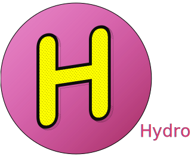

---
Bring stateful and reactive components to ASP.NET Core without writing JavaScript

---

Hydro is an extension to ASP.NET Core MVC and Razor Pages. It extends View Components to make them reactive and stateful with ability to communicate with each other without page reloads. As a result, you can create powerful components and make your application to feel like SPA with zero or minimal amount of the JavaScript code (depending on the needs) and without separate front-end build step. It can be used in new or existing ASP.NET Core applications.

Hydro utilizes the following technologies to make it all work:

- **Razor views (\*.cshtml)**  
Razor views form the backbone of Hydro's UI generation. They allow for a familiar, server-side rendering strategy that has been a foundation of .NET web development for many years. These *.cshtml files enable a seamless mix of HTML and C# code, allowing for robust and dynamic webpage generation.


- **AJAX**  
AJAX calls are used to communicate between the client and the server, specifically to send the application state to the server, receive updates and responses back, and then store this state to be used in subsequent requests. This ensures that each request has the most up-to-date context and information.


- **Alpine.js**  
Alpine.js stands as a base for requests execution and  DOM swapping. But beyond that, Alpine.js also empowers users by providing a framework for adding rich, client-side interactivity to the standard HTML. So, not only does it serve Hydro's internal operations, but it also provides an expansion point for users to enhance their web applications with powerful, interactive experiences.

## Documentation

- [Hydro documentation](https://usehydro.dev)

## Toolkit

- [Hydro toolkit](https://toolkit.usehydro.dev/)

## Samples

- [Simple sales application using Hydro](https://github.com/hydrostack/hydro-sales)
- [Simple to-do application using Hydro](https://github.com/hydrostack/hydro-todo)

## Installation

In ASP.NET Core Razor Pages / MVC project 6.0+ install Hydro package:
```console
dotnet add package Hydro
```

If you don't have application yet, you can create it first:

```console
dotnet new webapp -o MyApp
cd MyApp
```

In your application's startup code (either `Program.cs` or `Startup.cs`):

```c#
builder.Services.AddHydro();

...

app.UseHydro(builder.Environment);
```

In `_ViewImports.cshtml` add:
```razor
@addTagHelper *, {Your project assembly name}
@addTagHelper *, Hydro
```

In layout's `head` tag:
```html
<meta name="hydro-config" />
<script defer src="~/hydro/hydro.js" asp-append-version="true"></script>
<script defer src="~/hydro/alpine.js" asp-append-version="true"></script>
```

## Quick start
To create Hydro component, go to your components folder, for example in case of Razor Pages: `~/Pages/Components/`, and create these files:

```razor
<!-- Counter.cshtml -->

@model Counter

<div>
  Count: <strong>@Model.Count</strong>
  <button on:click="@(() => Model.Add())">
    Add
  </button>
</div>
```
```c#
// Counter.cs

public class Counter : HydroComponent
{
    public int Count { get; set; }
    
    public void Add()
    {
        Count++;
    }
}
```

### Usage

To use your new component, you can render it in your Razor Page (e.g. `Index.cshtml`) in two ways:

by calling a custom tag:
```razor
...
<counter />
...
```

by calling a generic tag helper:

```razor
...
<hydro name="Counter"/>
...
```

or by calling an extension method:
```razor
...
@await Html.Hydro("Counter")
...
```

And voilà! You can test your component by clicking on the `Add` button.

## External libraries

Hydro repository contains [Alpine.js](https://github.com/alpinejs/alpine) libraries MIT licensed.

## License

Hydro is Copyright © Krzysztof Jeske and other contributors under the [MIT license](https://raw.githubusercontent.com/hydrostack/hydro/main/LICENSE)
